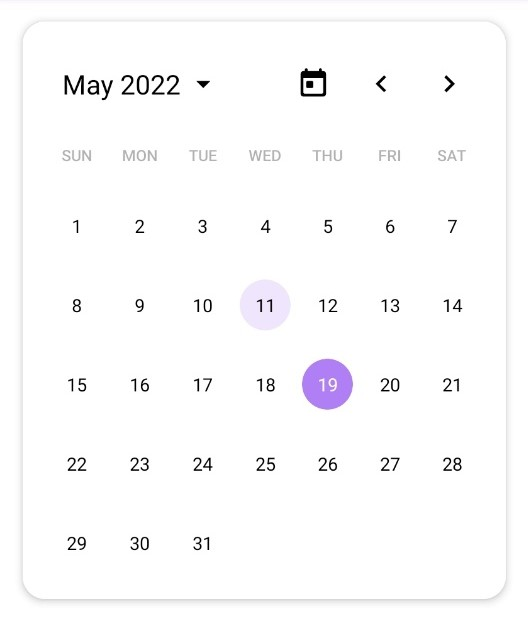
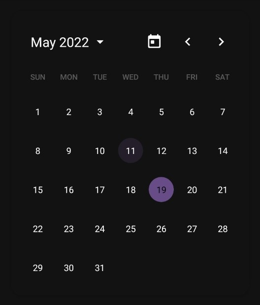

# 📅 Minimal Calendar 
This calendar library is built with jetpack compose. Easy, simple, and minimal.  

 


  

## Latest version
The stable version of the library is the version that uses `Compose 1.1.x`, and it can be used as follows to cope with the `Compose 1.2.x` version.
|Compose      |Library                                                                                                    |
|:------------|:---------------------------------------------------------------------------------------------------------:|
|1.1.x        |[](https://jitpack.io/#memeze/minimal-calendar)|
|1.2.x (alpha)|[](https://jitpack.io/#memeze/minimal-calendar)|


## Setup
👉 _**Step.1**_ [Java 8+ API desugaring support (Android Gradle Plugin 4.0.0+)](https://developer.android.com/studio/write/java8-support#library-desugaring).  
Include the following in your app module’s `build.gradle(app)` file:
```groovy
android {
    ....
    compileOptions {
        coreLibraryDesugaringEnabled true
    }
}

dependencies {
    coreLibraryDesugaring 'com.android.tools:desugar_jdk_libs:<latest-version>'
}
```
> See [here](https://mvnrepository.com/artifact/com.android.tools/desugar_jdk_libs) for the `<latest-version>`

</br>

👉 _**Step.2**_ Add it in your `setting.gradle`:
```groovy
dependencyResolutionManagement {
    repositoriesMode.set(RepositoriesMode.FAIL_ON_PROJECT_REPOS)
    repositories {
        ....
        maven { url "https://jitpack.io" }
    }
}
```

</br>

👉 **Step.3** _Add the dependency your `build.gradle(app)`:_
```groovy
dependencies {
    implementation 'com.github.memeze:minimal-calendar:<latest-version>'
}
```
> See [here](https://github.com/memeze/minimal-calendar#latest-version) for the `<latest-version>`

</br>

## Usage
#### calendar
```kotlin
fun MinimalCalendar(
    modifier: Modifier = Modifier,
    initDate: LocalDate = LocalDate.now(),
    onSelectDate: (date: LocalDate) -> Unit,
    calendarColors: MinimalCalendarColors = MinimalCalendarTheme.colors(),
    calendarConfig: MinimalCalendarConfig = MinimalCalendarConfig()
)
```
#### colors
```kotlin
data class MinimalCalendarColors(
    val defaultColor: Color,
    val backgroundColor: Color,
    val headerBackgroundColor: Color,
    val headerDateTextColor: Color,
    val headerTodayIconColor: Color,
    val headerArrowIconColor: Color,
    val headerSelectIconColor: Color,
    val selectionBackgroundColor: Color,
    val selectionItemTextColor: Color,
    val selectionItemSelectedBackgroundColor: Color,
    val selectionItemSelectedTextColor: Color,
    val selectionButtonBackgroundColor: Color,
    val selectionButtonTextColor: Color,
    val weekBackgroundColor: Color,
    val weekTextColor: Color,
    val dateTextColor: Color,
    val dateTodayBackgroundColor: Color,
    val dateTodayTextColor: Color,
    val dateSelectedBackgroundColor: Color,
    val dateSelectedTextColor: Color
)
```
#### config
```kotlin
data class MinimalCalendarConfig(
    val yearRange: IntRange = IntRange(1900, 2100),
    val locale: Locale = Locale.getDefault()
)
```

## License
```
 Copyright 2022 memeze

 Licensed under the Apache License, Version 2.0 (the "License")
 you may not use this file except in compliance with the License.
 You may obtain a copy of the License at

     http://www.apache.org/licenses/LICENSE-2.0

 Unless required by applicable law or agreed to in writing, software
 distributed under the License is distributed on an "AS IS" BASIS,
 WITHOUT WARRANTIES OR CONDITIONS OF ANY KIND, either express or implied.
 See the License for the specific language governing permissions and
 limitations under the License.
```
